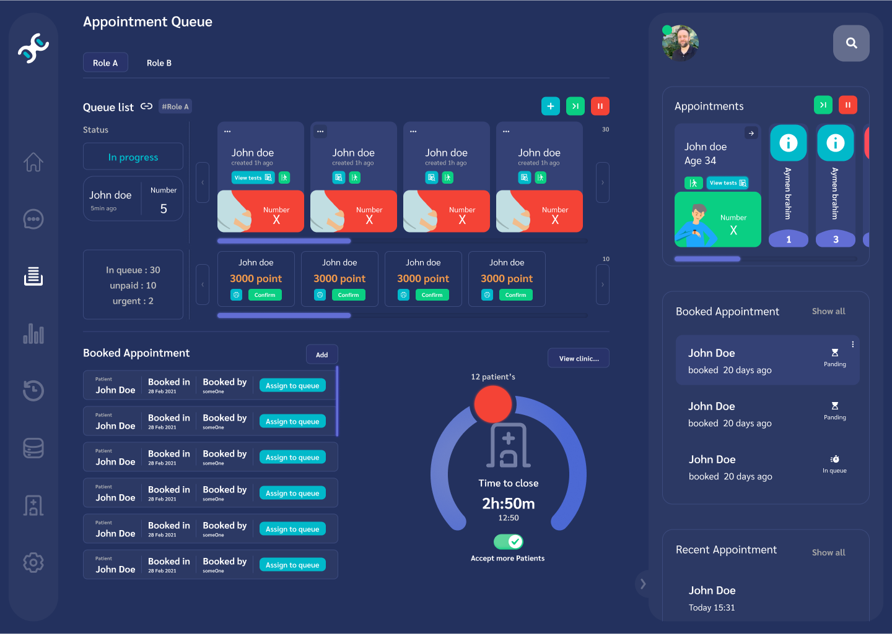

 <h1 align="center">DoctorIO "Clinicord-Client"</h1>

 

 
A desktop/web compatible software build with React and Electron

> DoctorIO is the project name for **Clinicord-Client**

**Clinicord-Client** is a desktop/web compatible software. It is an offline software that can connect to a Clinicord-server instance on a LAN to enable it features. Multiple instances of Clinicord-server can be joined but not at the same time.
###Installation
**Clinicord-Client** is not yet available for download. You can however build it yourself.
####Requirements

- [Node.js](https://nodejs.org/en/)
- [Yarn](https://yarnpkg.com/)
- [Git](https://git-scm.com/)

####Building

1. Clone the repository.
2. Install dependencies with `yarn install`.
3. Build the software with `yarn make ` or start the development server with `yarn startApp`. You can also start the web version with `yarn devServer`.

####Storybook
To view the components of the software, you can run `yarn storybook` to start the storybook server. Some components does not work because they require the context or an API calls.

### About Clinicord

Clinicord is a Medical practice management software/system tend to improve healthcare services. It is a platform that allows doctors to manage their patients, appointments, and medical records. It build for the interest of creating a secure and safe way to store and exchange medical records. Clinicord come with a pair of softwares.

**Clinicord-Client** is a desktop/web compatible software that provide a user interface for users to be able to join and interact with a Clinicord server. Clinicord-client is an offline software but to enable it feature the user must join a Clinicord-server instance. users can join multiple instances of Clinicord-server but not at the same time.

**Clinicord-server** is a software that creates an instance on the local network, User on the same network can connect to the server using Clinicord-client. Clinicord-server provides Services/API that allows the functionality of Clinicord.

#### features

**Intranet:** Clinicord is build for the purpose of working on a local network "LAN".

**Colaboration:** Clinicord is a LAN platform that allows communication and collaboration between members on the same network.

**Secure**: Clinicord is build with security in mind. Clinicord performs on a LAN which limit unauthorized access. It also uses RBAC to control access to resources. It encrypt all data before storing it on the server and uses E2EE to secure communications.

**Role-based**: Inspired by Discord, Clinicord uses a role-based access control system. Similar to Discord, Clinicord allow the creation of multiple roles.

**Invitation key**: The software uses a "Invitation-key" system for registration. A user can join a Clinicord server if and only if he provide a valid invitation key. Invitation keys are generated by members with sufficient permission.

**Authentication**: Clinicord uses a "Password" authentication system to authenticate registered users during the login phase. And uses a token-based authentication system to authenticate users during communication.

**Queue system**: Clinicord has a queue system that represents a waiting queue in a healthcare facility. Where a role can have a queue or can control another roles' queue.

**Appointment system**: Clinicord provide an appointment system. It allows for scheduling, storing and managing appointments.
**Medical session:** Medical session is way to improve the collection and distribution the information during a physical meeting between a member and a patient. A medical session can start after a patient from the waiting queue is being called. During the medical session, The member can collect information about the patient, type a diagnosis or a prescription, The software then will store the collected information and provide a printed copy to the patient.

**EMR**: Clinicord create a Record for each patient with the information collected during medical sessions and otherwise. Depends on rules set by the facility, Records can be accessed by the member who created them, specific roles or the facility.

**Patient health information protection:** Clinicord is not a HIPPA compliant software "yet", but it follows the HIPPA guidelines to protect patients' health information.

####Repositories
| Repo name | Job | Description
| :--- | :--- |:--- |
| Latus (Currently private)| Clinicord-server | NestJS based server for Clinicord
[DoctorIO](https://github.com/Danzo7/doctorIO) | Clinicord-client | React based client for Clinicord |
NightyUI (Currently in [DoctorIO](https://github.com/Danzo7/doctorIO))|UI library| A React UI library for Clinicord |
Docs (Currently private) | Documentation | Documentation for Clinicord |
Website (Not yet) | website | A website for Clinicord |
